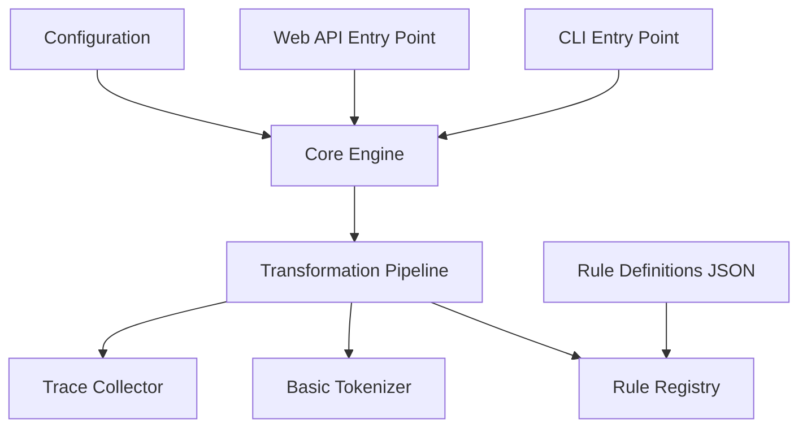

# Design Document

## Overview

This design document outlines the refactoring and enhancement of the Sanskrit Rewrite Engine from its current state to a well-structured, maintainable system. The design takes an incremental approach, first establishing proper project structure, consolidating APIs, and implementing a minimal but functional transformation engine that can evolve toward sophisticated Sanskrit processing capabilities. The architecture emphasizes clean interfaces, proper dependency management, and extensibility for future enhancements.

## Architecture

### Current State Analysis

The existing codebase has:
- Multiple server implementations (`simple_server.py`, `robust_server.py`, `start_server.py`)
- Missing core package structure (`sanskrit_rewrite_engine/` directory)
- Heavy dependencies not used by current functionality
- Tests in wrong location for pytest discovery
- Basic string transformation instead of sophisticated rule engine

### Target Architecture



### Refactoring Strategy

**Phase 1: Foundation**
1. Create proper package structure with `src/` layout
2. Consolidate server implementations into single FastAPI app
3. Right-size dependencies and create optional extras
4. Organize tests for proper pytest discovery

**Phase 2: Core Engine**
1. Implement minimal transformation engine with rule-based processing
2. Add basic tokenization for Sanskrit text
3. Create JSON-based rule definition system
4. Add comprehensive tracing and debugging

**Phase 3: Enhancement**
1. Improve tokenization with linguistic awareness
2. Add more sophisticated rule application logic
3. Enhance API with advanced features
4. Prepare architecture for future Pāṇini sūtra encoding

## Components and Interfaces

### Package Structure

```
src/
├── sanskrit_rewrite_engine/
│   ├── __init__.py
│   ├── engine.py          # Core transformation engine
│   ├── tokenizer.py       # Basic Sanskrit tokenizer
│   ├── rules.py           # Rule definition and registry
│   ├── server.py          # FastAPI web server
│   ├── cli.py             # Command-line interface
│   └── config.py          # Configuration management
tests/
├── test_engine.py
├── test_tokenizer.py
├── test_rules.py
└── test_api.py
data/
└── rules/
    ├── basic_sandhi.json
    └── compound_rules.json
```

### Core Engine Interface

```python
@dataclass
class TransformationResult:
    input_text: str
    output_text: str
    transformations_applied: List[str]
    trace: List[Dict[str, Any]]
    success: bool
    error_message: Optional[str] = None

class SanskritRewriteEngine:
    def __init__(self, config: Optional[Dict] = None):
        self.tokenizer = BasicSanskritTokenizer()
        self.rule_registry = RuleRegistry()
        self.config = config or {}
        
    def process(self, text: str) -> TransformationResult:
        """Main processing method"""
        
    def load_rules(self, rule_file: str) -> None:
        """Load rules from JSON file"""
        
    def add_rule(self, rule: Rule) -> None:
        """Add a single rule programmatically"""
```

### Rule System

```python
@dataclass
class Rule:
    id: str
    name: str
    description: str
    pattern: str          # Regex or simple pattern to match
    replacement: str      # Replacement text or template
    priority: int = 1     # Lower numbers = higher priority
    enabled: bool = True
    metadata: Dict[str, Any] = field(default_factory=dict)
    
    def matches(self, text: str, position: int) -> bool:
        """Check if rule matches at given position"""
        
    def apply(self, text: str, position: int) -> Tuple[str, int]:
        """Apply rule and return new text and next position"""

class RuleRegistry:
    def __init__(self):
        self._rules: List[Rule] = []
        
    def load_from_json(self, file_path: str) -> None:
        """Load rules from JSON configuration"""
        
    def add_rule(self, rule: Rule) -> None:
        """Add a rule to the registry"""
        
    def get_applicable_rules(self, text: str, position: int) -> List[Rule]:
        """Get rules that can apply at the given position"""
        
    def get_rules_by_priority(self) -> List[Rule]:
        """Get all enabled rules sorted by priority"""
```

### Tokenizer System

```python
@dataclass
class Token:
    text: str
    start_pos: int
    end_pos: int
    token_type: str = "WORD"  # WORD, PUNCTUATION, WHITESPACE, MARKER
    metadata: Dict[str, Any] = field(default_factory=dict)

class BasicSanskritTokenizer:
    def __init__(self):
        self.sanskrit_chars = set("अआइईउऊऋॠऌॡएऐओऔकखगघङचछजझञटठडढणतथदधनपफबभमयरलवशषसह")
        self.markers = set("+-_:")
        
    def tokenize(self, text: str) -> List[Token]:
        """Tokenize Sanskrit text into basic units"""
        
    def is_sanskrit_char(self, char: str) -> bool:
        """Check if character is Sanskrit"""
        
    def preserve_markers(self, text: str) -> List[str]:
        """Split text while preserving morphological markers"""
```

### FastAPI Server Interface

```python
from fastapi import FastAPI, HTTPException
from pydantic import BaseModel

class ProcessRequest(BaseModel):
    text: str
    rules: Optional[List[str]] = None  # Optional rule set names
    trace: bool = False

class ProcessResponse(BaseModel):
    input_text: str
    output_text: str
    transformations: List[str]
    trace: Optional[List[Dict]] = None
    success: bool
    error: Optional[str] = None

app = FastAPI(title="Sanskrit Rewrite Engine", version="1.0.0")

@app.post("/process", response_model=ProcessResponse)
async def process_text(request: ProcessRequest):
    """Main text processing endpoint"""

@app.get("/health")
async def health_check():
    """Health check endpoint"""

@app.get("/rules")
async def list_rules():
    """List available rules"""
```

### CLI Interface

```python
import click
from sanskrit_rewrite_engine import SanskritRewriteEngine

@click.group()
def cli():
    """Sanskrit Rewrite Engine CLI"""
    pass

@cli.command()
@click.argument('text')
@click.option('--rules', '-r', help='Rule set to use')
@click.option('--trace', '-t', is_flag=True, help='Show transformation trace')
def process(text: str, rules: Optional[str], trace: bool):
    """Process Sanskrit text with transformations"""
    
@cli.command()
@click.option('--host', default='localhost')
@click.option('--port', default=8000)
def serve(host: str, port: int):
    """Start the web server"""
    
if __name__ == '__main__':
    cli()
```

### Configuration Management

```python
@dataclass
class EngineConfig:
    max_iterations: int = 10
    enable_tracing: bool = True
    rule_directories: List[str] = field(default_factory=lambda: ["data/rules"])
    default_rule_set: str = "basic_sandhi"
    
    @classmethod
    def from_file(cls, config_path: str) -> 'EngineConfig':
        """Load configuration from JSON/YAML file"""
        
    def to_dict(self) -> Dict[str, Any]:
        """Convert to dictionary for serialization"""
```

## Data Models

### Rule Definition Format (JSON)

```json
{
  "rule_set": "basic_sandhi",
  "version": "1.0",
  "rules": [
    {
      "id": "vowel_sandhi_a_i",
      "name": "a + i → e",
      "description": "Combine 'a' and 'i' vowels into 'e'",
      "pattern": "a\\s*\\+\\s*i",
      "replacement": "e",
      "priority": 1,
      "enabled": true,
      "metadata": {
        "category": "vowel_sandhi",
        "sutra_ref": "future_reference"
      }
    },
    {
      "id": "compound_join",
      "name": "Join compounds",
      "description": "Join words marked with + into compounds",
      "pattern": "([a-zA-Zअ-ह]+)\\s*\\+\\s*([a-zA-Zअ-ह]+)",
      "replacement": "$1$2",
      "priority": 2,
      "enabled": true,
      "metadata": {
        "category": "compound_formation"
      }
    }
  ]
}
```

### Dependency Management

```toml
# pyproject.toml
[project]
name = "sanskrit-rewrite-engine"
dependencies = [
    "fastapi>=0.100.0",
    "uvicorn>=0.20.0",
    "click>=8.0.0",
    "pydantic>=2.0.0"
]

[project.optional-dependencies]
dev = [
    "pytest>=7.0.0",
    "black>=23.0.0",
    "isort>=5.0.0",
    "flake8>=6.0.0",
    "mypy>=1.0.0"
]
web = [
    "jinja2>=3.0.0",
    "python-multipart>=0.0.6"
]
gpu = [
    "torch>=2.0.0",
    "transformers>=4.20.0"
]
```

### Security and CORS Configuration

```python
from fastapi.middleware.cors import CORSMiddleware
from fastapi.middleware.trustedhost import TrustedHostMiddleware

# Security configuration
app.add_middleware(
    CORSMiddleware,
    allow_origins=["http://localhost:3000", "http://127.0.0.1:3000"],  # Specific origins
    allow_credentials=True,
    allow_methods=["GET", "POST"],
    allow_headers=["*"],
)

app.add_middleware(
    TrustedHostMiddleware, 
    allowed_hosts=["localhost", "127.0.0.1"]
)

# Request validation and limits
from fastapi import Request, HTTPException
import time

@app.middleware("http")
async def add_process_time_header(request: Request, call_next):
    start_time = time.time()
    response = await call_next(request)
    process_time = time.time() - start_time
    response.headers["X-Process-Time"] = str(process_time)
    return response

# Content length limits
MAX_REQUEST_SIZE = 1024 * 1024  # 1MB
```

## Error Handling

### Error Types and Recovery

```python
class SanskritEngineError(Exception):
    """Base exception for Sanskrit engine errors"""
    pass

class RuleLoadError(SanskritEngineError):
    """Error loading rule definitions"""
    pass

class ProcessingError(SanskritEngineError):
    """Error during text processing"""
    pass

# Error handling in API
@app.exception_handler(SanskritEngineError)
async def engine_exception_handler(request: Request, exc: SanskritEngineError):
    return JSONResponse(
        status_code=400,
        content={
            "error": "Processing Error",
            "message": str(exc),
            "type": exc.__class__.__name__
        }
    )

# Graceful degradation
def safe_process(text: str, engine: SanskritRewriteEngine) -> TransformationResult:
    try:
        return engine.process(text)
    except Exception as e:
        return TransformationResult(
            input_text=text,
            output_text=text,  # Return original on error
            transformations_applied=[],
            trace=[],
            success=False,
            error_message=str(e)
        )
```

## Testing Strategy

### Test Organization

```
tests/
├── unit/
│   ├── test_engine.py      # Core engine functionality
│   ├── test_tokenizer.py   # Tokenization logic
│   ├── test_rules.py       # Rule loading and application
│   └── test_config.py      # Configuration management
├── integration/
│   ├── test_api.py         # FastAPI endpoint testing
│   ├── test_cli.py         # CLI interface testing
│   └── test_end_to_end.py  # Complete workflow testing
└── fixtures/
    ├── sample_rules.json
    └── test_texts.txt
```

### Testing Approach

1. **Unit Tests**
   - Test individual components in isolation
   - Mock external dependencies
   - Focus on edge cases and error conditions
   - Use pytest fixtures for common test data

2. **Integration Tests**
   - Test API endpoints with TestClient (no live server needed)
   - Test CLI commands with subprocess
   - Test rule loading from actual JSON files
   - Validate complete transformation workflows

3. **API Testing Example**
```python
from fastapi.testclient import TestClient
from sanskrit_rewrite_engine.server import app

client = TestClient(app)

def test_process_endpoint():
    response = client.post("/process", json={
        "text": "rāma + iti",
        "trace": True
    })
    assert response.status_code == 200
    data = response.json()
    assert data["success"] is True
    assert "rāmeti" in data["output_text"]
```

## Development Workflow

### Project Setup

```bash
# Development setup
git clone <repository>
cd sanskrit-rewrite-engine
python -m venv venv
source venv/bin/activate  # or venv\Scripts\activate on Windows
pip install -e .[dev]

# Install pre-commit hooks
pre-commit install

# Run tests
pytest

# Start development server
sanskrit-cli serve --reload
```

### Code Quality Tools

```yaml
# .pre-commit-config.yaml
repos:
  - repo: https://github.com/psf/black
    rev: 23.3.0
    hooks:
      - id: black
  - repo: https://github.com/pycqa/isort
    rev: 5.12.0
    hooks:
      - id: isort
  - repo: https://github.com/pycqa/flake8
    rev: 6.0.0
    hooks:
      - id: flake8
  - repo: https://github.com/pre-commit/mirrors-mypy
    rev: v1.3.0
    hooks:
      - id: mypy
```

### CI/CD Pipeline

```yaml
# .github/workflows/test.yml
name: Test
on: [push, pull_request]
jobs:
  test:
    runs-on: ubuntu-latest
    steps:
      - uses: actions/checkout@v3
      - uses: actions/setup-python@v4
        with:
          python-version: '3.9'
      - run: pip install -e .[dev]
      - run: black --check .
      - run: isort --check-only .
      - run: flake8 .
      - run: mypy src/
      - run: pytest
```

## Migration Strategy

### Phase 1: Foundation (Immediate)
1. Create `src/sanskrit_rewrite_engine/` package structure
2. Consolidate existing servers into single FastAPI app
3. Move tests to `tests/` directory and fix pytest configuration
4. Create proper `.gitignore` and clean up repository
5. Right-size dependencies in `pyproject.toml`

### Phase 2: Core Implementation (Short-term)
1. Implement basic `SanskritRewriteEngine` class
2. Create `BasicSanskritTokenizer` for text segmentation
3. Implement JSON-based rule loading system
4. Add CLI interface with click
5. Create comprehensive test suite

### Phase 3: Enhancement (Medium-term)
1. Improve tokenization with Sanskrit linguistic awareness
2. Add more sophisticated rule application logic
3. Enhance API with advanced features and better error handling
4. Add performance optimizations and caching
5. Create comprehensive documentation

### Future Evolution Path
The architecture is designed to support future enhancements:
- Token-based processing with linguistic metadata
- Pāṇini sūtra encoding and rule hierarchies
- Integration with machine learning components
- Advanced Sanskrit computational linguistics features

This incremental approach ensures that each phase delivers working functionality while building toward the sophisticated system described in the original vision.