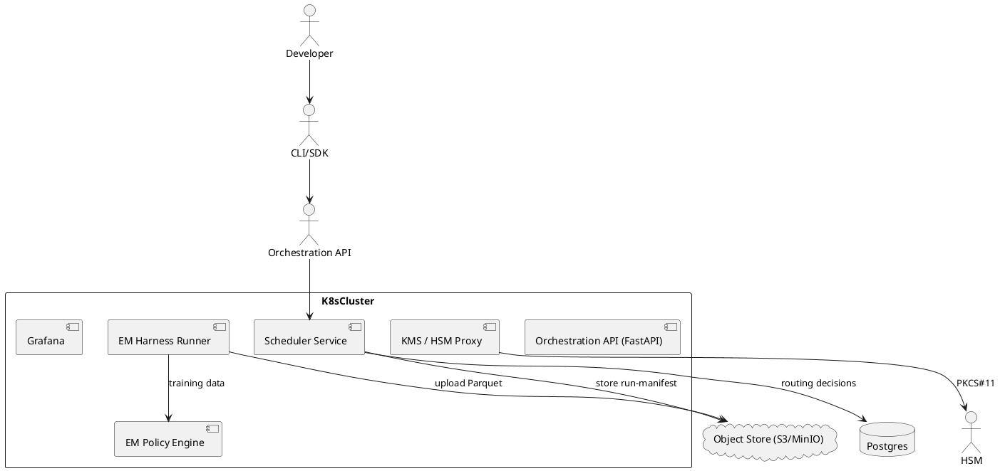

# SPEC-001-QuantumAI — End-to-End Prototype Spec

## Background

The Quantum–Classical Hybrid AI Platform provides an enterprise-grade framework for running quantum workloads with provable provenance, crypto-agility (classical + post-quantum), and noise-aware execution. The MVP (prototype) covers:

- FIPS-certified post-quantum cryptography (PQC) integration and HSM-backed KMS for signed, auditable run-manifests.
- Nightly, reproducible error-mitigation (EM) benchmarking harness (ZNE + Richardson + ML-QEM baselines) with archived lineage data.
- An EM Policy Engine (rules + ML) recommending mitigation method + estimated overhead and fidelity.
- A Noise-/EM-aware Scheduler that routes jobs to backends to maximize post-EM fidelity per cost while enforcing crypto-mode constraints.

This doc is written for the engineering team as a sprintable, implementable spec (code + infra + tests + acceptance criteria).

---

## Requirements (MoSCoW)

### Must (A)

1. **HSM-backed KMS** (PKCS#11 + cloud HSM integration): generate/rotate PQC private keys (ML-KEM, ML-DSA, SPHINCS+), provide signing API and audit logs. Keys must never be exported in plaintext.
2. **Dual-stack TLS demo**: client/server demo that negotiates classical cipher suites + PQC KEM in a dual-stack handshake (demo/fallback mode).
3. **Signed run-manifests**: CLI + SDK hook that emits JSON/YAML run-manifests containing job metadata and an HSM signature (manifest persisted in object store and manifest index in DB).
4. **EM regression harness**: reproducible harness to run circuit families (random, trotter, variational) across simulators and vendor backends and persist results (Parquet + metadata).
5. **ML-QEM baseline**: implement ML-QEM (random forest + simple NN experiment) and ZNE baseline in harness to compare accuracy vs cost.
6. **EM nightly pipeline**: scheduled nightly run that writes dashboard snapshots, stores training data, and alerts on model drift.
7. **EM Policy Engine**: REST service returning recommended EM method, parameters, shot-overhead estimate, and confidence.
8. **Scheduler v1 plugin**: scoring/routing that uses EM-policy outputs + backend calibration to choose backend subject to SLA and crypto-mode filters.
9. **Audit & provenance**: immutable manifests, signed artifacts, and tamper-evident run ledger (object-store + signed hashes).
10. **CI/CD & supply-chain controls**: reproducible builds, container signing (Cosign/Sigstore), in-toto attestations for critical steps.

### Should (B)

1. Telemetry dashboards (Grafana/Prometheus) for quantum SRE: fidelity, EM overhead, scheduler compliance, reproducibility.
2. Dev-friendly HSM simulator support and migration playbook for production HSM (CloudHSM / Managed HSM).
3. Basic QKD-hardening checklist & optional gating to exclude QKD where unsupported.
4. Integration adapters for at least two QPU vendors or a robust mock adapter in CI.

### Could (C)

1. QKD pilot (scoped) with ITU/ETSI hardening for nodes (optional, later phase).
2. Multi-tenant RBAC and per-tenant crypto policy enforcement.
3. Advanced scheduler ML for long-horizon predictions (v2).

### Won’t (for MVP)

1. Full production-grade HSM cluster multi-region orchestration (beyond standard cloud HSM features).
2. Wide QKD deployments — only a narrow pilot if requested.

---

## Method (technical design)

### Overall architecture (text)

The system splits into modular services deployed on Kubernetes (K8s) in a secure VPC.

- **KMS/HSM service** (python service, PKCS#11 layer) — talks to cloud HSM (AWS CloudHSM / Azure Managed HSM) for key ops and signs manifests.
- **Orchestration API** (gRPC + REST, FastAPI) — job ingest, manifest validation, submit-to-scheduler.
- **CLI & Python SDK** — manifest generator hooks, job submit, verification utilities.
- **EM-harness & trainer** — runs circuits, stores Parquet datasets, trains ML-QEM models.
- **EM Policy Engine** (FastAPI) — feature-engineering + model (random forest + NN regressor ensemble) with REST endpoint.
- **Scheduler service** — plugin architecture for scoring backends, crypto-mode enforcement, and routing decisions (persisted in manifest).
- **Storage**: S3/MinIO for artifacts, Parquet output; PostgreSQL for metadata; Redis for queues; Prometheus + Grafana for telemetry.
- **CI/CD**: GitHub Actions + container builds, in-toto attestation and Cosign signatures.

Below is a PlantUML sketch (copy into any PlantUML renderer).



### Data model (manifest + metadata)

**run\_manifest (JSON/YAML)** — stored as object and indexed in `manifests` table:

```json
{
  "job_id": "uuid",
  "tenant": "org-a",
  "backend_id": "ibm.qpu.1",
  "pqc_suite": "ML-KEM:ML-DSA:SPHINCS+",
  "crypto_mode": "pqc-required",
  "calibration_snapshot_id": "cal-2025-07-14T23:00:00Z",
  "em_method": "ml-qem",
  "em_version": "v0.2",
  "seed": "sha256:...",
  "created_at": "2025-07-21T12:00:00Z",
  "signature": "sigbase64...",
  "artifact_hash": "sha256:..."
}
```

**SQL schema (Postgres)** — key tables (DDL samples):

```sql
CREATE TABLE backends (
  backend_id TEXT PRIMARY KEY,
  vendor TEXT,
  region TEXT,
  cost_per_shot NUMERIC,
  availability FLOAT,
  capabilities JSONB,
  last_calibration_id TEXT
);

CREATE TABLE calibration_snapshots (
  id TEXT PRIMARY KEY,
  backend_id TEXT REFERENCES backends(backend_id),
  created_at TIMESTAMP,
  gates JSONB,
  readout_errors JSONB,
  raw_metrics JSONB
);

CREATE TABLE manifests (
  job_id UUID PRIMARY KEY,
  tenant TEXT,
  backend_id TEXT,
  pqc_suite TEXT,
  crypto_mode TEXT,
  calibration_snapshot_id TEXT,
  em_method TEXT,
  signature TEXT,
  s3_path TEXT,
  created_at TIMESTAMP
);

CREATE TABLE em_results (
  result_id UUID PRIMARY KEY,
  job_id UUID REFERENCES manifests(job_id),
  circuit_family TEXT,
  shots INTEGER,
  unmitigated_fidelity FLOAT,
  mitigated_fidelity FLOAT,
  em_method TEXT,
  cost_seconds FLOAT,
  created_at TIMESTAMP,
  parquet_path TEXT
);

CREATE TABLE scheduler_decisions (
  id UUID PRIMARY KEY,
  job_id UUID,
  chosen_backend TEXT,
  score FLOAT,
  reasons JSONB,
  decision_manifest_path TEXT,
  created_at TIMESTAMP
);
```

Store the heavy numeric experiment data (raw histograms, trained model blobs, Parquet) in S3; keep indexes in Postgres.

### Scheduler scoring & algorithm

**v1 scoring formula (implementable pseudocode):**

```
score(backend, job) = (expected_postEM_fidelity / effective_cost) * availability_penalty * crypto_compatibility

where
expected_postEM_fidelity = em_policy.estimate_fidelity(backend.calibration, circuit_features, em_choice)
effective_cost = backend.cost_per_shot * estimated_shot_multiplier
availability_penalty = 1 if backend.availability > threshold else (availability_factor < 1)
crypto_compatibility = 1.0 if backend.supports_crypto_mode else 0.0
```

**Algorithm flow:**

1. Orchestration server receives job + manifest.
2. Preprocess circuit features (depth, gate counts, entanglers, qubit\_count).
3. Query `EM Policy Engine` for recommended EM method and estimated shot multiplier + fidelity.
4. Query backend catalog (calibration snapshots) and compute `expected_postEM_fidelity` per backend.
5. Filter backends by `crypto_mode` and capability.
6. Compute `score` and pick backend with highest score meeting latency/SLA constraints.
7. Persist scheduling decision into `scheduler_decisions` and sign the decision with KMS.

**Determinism & reproducibility:** seed random components, store calibration snapshot id + SDK version + manifest signature. All scheduling decisions must be traceable and re-playable by the manifest + calibration snapshot.

### EM Policy Engine — ML design

**Features & inputs:**

- Circuit features: depth, two-qubit gate count, single-qubit gate count, number of measurements, qubit mapping entropy.
- Backend features: single- and two-qubit fidelities, readout error rates, coherence times, timestamp of calibration.
- Shot budget & latency constraint.
- Historical performance: past EM runs’ unmitigated and mitigated fidelities for similar circuits.

**Model architecture v1:**

- **Ranker**: RandomForestClassifier / XGBoost to pick between ["none", "zne", "richardson", "ml-qem"] — outputs ranking scores.
- **Regressor**: Small MLP (2 hidden layers, ReLU, 64/32) to predict multiplicative shot-overhead and expected post-EM fidelity.
- Ensemble: combine ranker + regressor, return confidence (predict\_proba / variance).

**Training pipeline:**

- Data ingestion from nightly EM harness Parquet (ETL via Spark or Pandas for smaller datasets).
- Feature store: store processed features in `model_features` (Parquet + versioned by calibration id).
- Training infra: run on a GPU node or CPU depending on size (use MLFlow for tracking models and metadata).
- Retrain cadence: nightly/weekly if drift detected (CI check compares predicted vs observed fidelity delta).

**Service:** FastAPI endpoint `/predict` that returns `{method, params, shot_multiplier, expected_fidelity, confidence}`.

### EM harness & benchmarking

- Circuit families: random circuits, trotter small-molecules, VQE/QAOA families.
- Methods included: unmitigated, ZNE (polynomial + Richardson variants), ML-QEM (RandomForest/MLP/GNN variants).
- Execution modes: simulator (local / cloud) and vendor adapter (IBM/AWS/Braket) or mocked adapter in CI.
- Outputs: per-run Parquet with schema: `{job_id, circuit_id, family, shots, raw_histogram_path, unmitigated_fidelity, mitigated_fidelity, method, parameters, runtime_seconds}`.
- Nightly pipeline: run small curated workload on each backend + simulator, store aggregated snapshot; compute drift metrics and update model training dataset.

### Cryptography & supply chain

- Use **liboqs** + OQS provider for PQC (supporting ML-KEM / ML-DSA / SPHINCS+). Provide an abstraction layer for future swaps.
- HSM integration via PKCS#11 (python-pkcs11 / PyKCS11) for signing manifests and storing private PQC keys.
- Container signing and artifact provenance: **Cosign** (Si
